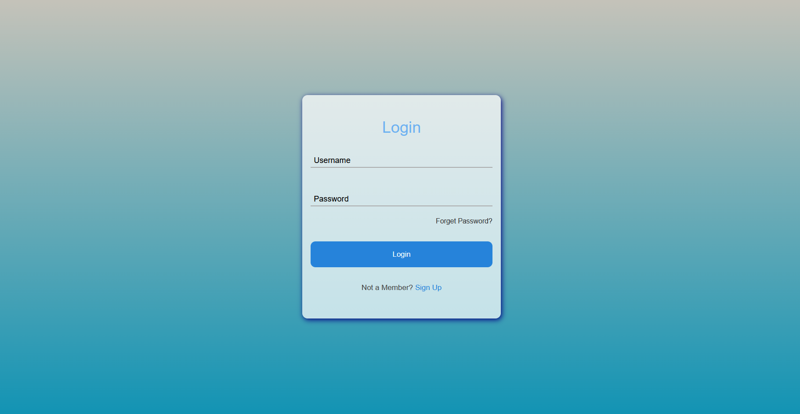
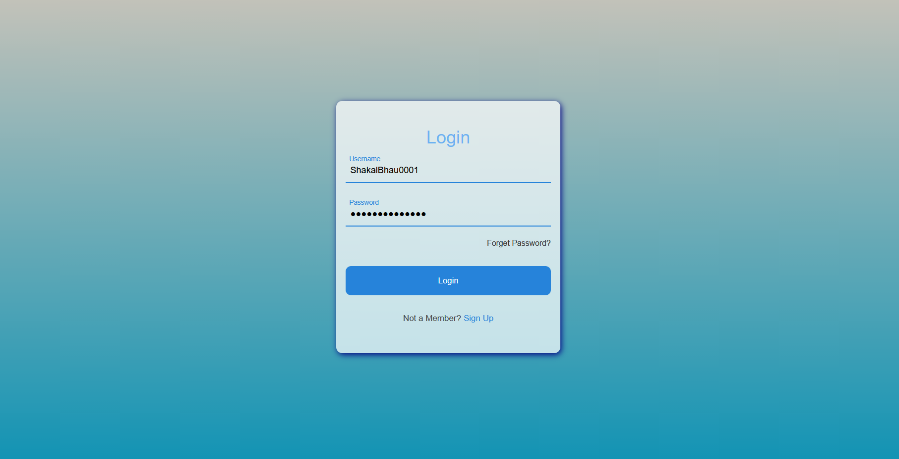

# 🔐 Animated Login UI (HTML & CSS)

A clean and modern **animated login page UI** built using **pure HTML and CSS**.  
This project focuses on **frontend design**, **floating label animations**, and **smooth user interactions** without using JavaScript or any backend logic.

It is created as a **UI/UX practice project** to strengthen form design skills and understand how polished authentication interfaces are structured visually.

---

## 🧱 Project Structure

```bash
animated-login-ui/
│
├── assets/           # Screenshots
├── index.html        # Login page markup
├── index.css         # Styling and animations
└── README.md         # Project documentation
```

---

## ✨ Features

### 🎨 Modern Login Interface
- Clean and minimal login form layout
- Centered card-based design
- Soft gradient background

### ✍️ Floating Label Animation
- Input labels animate smoothly on focus
- Visual feedback for active and filled fields
- Improves clarity and user experience

### 💡 Smooth UI Transitions
- CSS-based transitions and hover effects
- Button interaction feedback
- Subtle underline animation for inputs

### 📱 Responsive Layout
- Works well across different screen sizes
- Uses flexible width and centered alignment

---

## 🛠 Technologies Used

| Technology          | Role                        |
| ------------------- | --------------------------- |
| **HTML5**           | Structure and form markup   |
| **CSS3**            | Styling, layout, animations |
| **Flexbox**         | Centering and alignment     |
| **CSS Transitions** | Smooth UI effects           |

---

## 📌 Purpose of This Project

This project is built to:
- Practice **frontend form design**
- Learn **CSS animations and transitions**
- Understand floating label UX patterns
- Build visually appealing authentication UIs
- Improve HTML & CSS structuring skills

> ⚠️ This is a **UI-only project**. It does not include authentication logic, validation, or backend integration.

---

## ▶️ How to Use

### 1️⃣ Clone the repository

```bash
git clone https://github.com/ShakalBhau0001/animated-login-ui.git
```

### 2️⃣ Open the project

Simply open `index.html` in any modern web browser.
No server, build tools, or dependencies are required.

---

## ⚠️ Limitations

- No backend authentication
- No JavaScript validation
- Accessibility features are minimal
- Intended only for UI demonstration and learning

---

## 🌟 Future Improvements

- Add signup page UI
- Add password visibility toggle
- Improve accessibility
- Mobile-specific refinements
- Integrate with backend authentication

---

## ⚠️ Disclaimer

This project is created **for learning and frontend practice purposes only**.
It demonstrates **UI/UX design concepts**, not real authentication or security mechanisms.
Do not use this directly in production without proper backend and security handling.

---

## 📸 Preview

### Login UI





---

## 🪪 Author

> **Developer: Shakal Bhau**

> **GitHub: [ShakalBhau0001](https://github.com/ShakalBhau0001)**

---

## ⭐ Support

If you like this project, consider giving it a ⭐ on GitHub!

---
